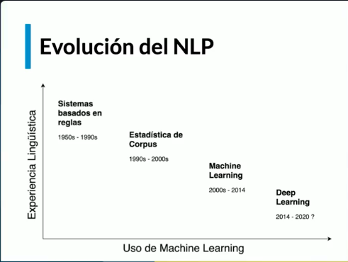

para buscar: cmd  +  F
para visualizar: cmd + altizq + v
para guardar: cmd + s

## Git Hub

Pasos para conectar tu proyecto a GitHub

1. Crea el repositorio en GitHub
Ve a github.com

Inicia sesión.

Haz clic en "New" o "Nuevo repositorio"

Asigna un nombre, por ejemplo: Procesamiento_de_Lenguaje_Natural_con_Python_y_NLTK

No marques la opción de crear README si ya tienes archivos locales.

Crea el repositorio y copia la URL SSH.

2. Desde la terminal: entra a la carpeta del proyecto local
```sh
cd ruta/a/tu/proyecto
```

3. Inicializa Git
```sh
git init
```

4. Agrega todos los archivos al área de preparación
```sh
git add .
```

5. Haz el primer commit
```sh
git commit -m "primero 28_6_25"
```

6. Conecta tu proyecto local con el repositorio de GitHub
Asegúrate de copiar tu enlace SSH correcto. Por ejemplo:

```sh
git remote add origin git@github.com:joanflorez-alt/Procesamiento_de_Lenguaje_Natural_con_Python_y_NLTK.git
```

7. Envía tu proyecto a GitHub (rama main)
```sh
git push -u origin main
```

# Próximos pasos útiles

🔸 Para subir futuros cambios:
```sh
git add .
git commit -m "Mi nuevo cambio"
git push
```

🔸 Para ver el estado actual del repositorio:
```sh
git status
```
🔸 Para clonar el repositorio en otro equipo:
```sh
git clone git@github.com:joanflorez-alt/Procesamiento_de_Lenguaje_Natural_con_Python_y_NLTK.git
```


## Procesamiento de Lenguaje Natural con Python y NLTK


¿Qué es el procesamiento del lenguaje natural?
El procesamiento del lenguaje natural (NLP) es un campo que fusiona ciencias de la computación, lingüística e inteligencia artificial. Su objetivo es lograr que las máquinas interactúen de manera efectiva con los humanos usando el lenguaje que utilizamos para comunicarnos día a día. Dentro del NLP, el Entendimiento del Lenguaje Natural (NLU, por sus siglas en inglés) se dedica a tareas específicas que demuestran que una máquina no solo puede procesar nuestro idioma, sino también comprenderlo para responder de manera coherente.

¿Cuál es el papel del test de Turing en la inteligencia artificial?
Alan Turing, un matemático brillante de la Segunda Guerra Mundial, es conocido por haber contribuido al desarrollo de la inteligencia artificial. Su legado incluye el Test de Turing, que propone una idea sencilla y poderosa: si un humano no puede distinguir a una máquina de una persona durante una conversación, la máquina alcanza un nivel de inteligencia comparable al humano. Este test representa un hito en la identificación del lenguaje como una medida de la inteligencia de una máquina.

Un ejemplo popular en la cultura es el test de Beuyk Kampff de la película "Blade Runner", donde se verifica si un individuo es humano o un replicante. Esta referencia cultural refuerza la importancia del procesamiento del lenguaje natural en el avance hacia la identificación de la inteligencia artificial.

¿Cuáles son las aplicaciones actuales del NLP?
El procesamiento del lenguaje natural se utiliza en diversas aplicaciones cotidianas:

Motores de búsqueda: Google, por ejemplo, usa algoritmos de NLP para interpretar consultas y brindar respuestas precisas.

Traducción automática: Herramientas como Google Translate dependen del NLP para convertir texto entre diferentes idiomas.

Chatbots: Los asistentes virtuales conversacionales son uno de los usos más reconocidos del NLP.

Análisis de discurso y reconocimiento del habla: Estos algoritmos identifican y transforman el lenguaje hablado en texto y viceversa.

¿Por qué es difícil el procesamiento del lenguaje natural?
El principal reto del NLP radica en la complejidad y ambigüedad del lenguaje humano. Un ejemplo claro es interpretaciones posibles para un anuncio de trabajo que busque "gente para trabajar entre dieciocho y treinta años". Una persona entiende que se refiere a la edad del candidato, pero un algoritmo, sin contexto, podría interpretar esto de manera distinta. El lenguaje humano es intrínsecamente difuso y requiere una comprensión contextual que a menudo no está explícita. Por ello, el avance en este campo es desafiante, pero también crucial para mejorar la interacción entre máquinas y humanos.


# EVOLUCIÓN DEL NLP


¿Cómo ha evolucionado el procesamiento del lenguaje natural?
El procesamiento del lenguaje natural (PLN) ha recorrido un largo camino desde sus inicios. Desde las primeras propuestas de Turing en los años cincuenta, pasando por el auge de los sistemas basados en reglas, hasta las innovaciones actuales con el deep learning. Este fascinante viaje revela cómo la tecnología y la lingüística se han combinado para acercarnos a máquinas que no solo entienden sino que también interactúan con nosotros.

¿Cuál fue el papel de los sistemas basados en reglas?
Al principio, los sistemas de PLN eran principalmente basados en reglas. Estas máquinas no aprendían de forma autónoma; en cambio, se programaban con reglas lingüísticas predefinidas. Esto les permitía generar conversaciones y reconocer si una frase estaba escrita o pronunciada correctamente, pero su capacidad era limitada. Fue un enfoque predominante hasta los años noventa, cuando la estadística empezó a jugar un papel más importante.

¿Cómo la estadística transformó el PLN?
A partir de los años noventa, las técnicas estadísticas comenzaron a dominar el PLN. Esto implicó entrenar algoritmos usando grandes corpus de texto, permitiendo a las máquinas aprender distribuciones probables de palabras. Esta transición marcó un cambio significativo: de basarse en reglas fijas a modelos que podían comprender y generar frases con sentido gramatical mediante el aprendizaje de patrones.

¿El rol de machine learning y deep learning en PLN?
A partir del año 2000, el machine learning tomó relevancia, ofreciendo algoritmos más sofisticados que se perfeccionaron hasta 2014. El verdadero punto de inflexión fue la democratización de las GPUs, permitiendo que el deep learning fuera accesible y revolucionara el PLN. Hoy en día, el deep learning es considerado el estado del arte, posibilitando algoritmos altamente precisos y eficientes para la comprensión y generación del lenguaje.

¿Por qué importa el entendimiento de texto a bajo nivel?
El análisis preciso de texto a bajo nivel es crucial en PLN. Existen algoritmos diseñados específicamente para tareas como clasificación de texto, análisis de sentimientos y comprensión contextual. Aunque son extremadamente eficaces en sus tareas, suelen estar limitados a un solo tipo de tarea.

¿Qué son los modelos multitarea y cuáles son sus ventajas?
Los avances en aprendizaje de representaciones han dado lugar a modelos multitarea, que utilizan redes neuronales para realizar múltiples funciones simultáneamente. Basados en conceptos matemáticos de representación, estos modelos asignan vectores a palabras y frases para identificar similitudes semánticas, permitiendo un procesamiento más versátil y eficaz.

¿Cuáles son las innovaciones recientes en arquitecturas neuronales?
Desde 2018, las arquitecturas como las redes Transformer y Reformer han revolucionado el PLN gracias a los mecanismos de atención. Estos permiten un análisis más inteligente de las secuencias de texto, procesando solo las palabras relevantes dentro de una frase sin analizarla por completo. Aunque estos avances son notables, aún existe el desafío de desarrollar algoritmos con comprensión de sentido común similar a la humana.

¿Cómo puedes iniciarte en el procesamiento del lenguaje natural?
Hoy en día, el aprendizaje de PLN comienza con el uso de dos librerías fundamentales: NLTK y spaCy. Estas herramientas ofrecen la base necesaria para explorar desde tareas simples hasta aplicaciones industriales más complejas.

¿Cómo se estructura el camino de aprendizaje en este curso?
El curso se divide en bloques esenciales:

Fundamentos de PLN con NLTK: Para entender y usar la estadística de corpus en tareas de PLN.

Aplicaciones: Usando NLTK para crear modelos que desempeñen diversas tareas de PLN.

NLP Industrial: Cómo escalar modelos a aplicaciones reales usando spaCy.

Bloque avanzado: Combinando NLTK y spaCy para abordar conceptos más complejos en PLN.

Con este camino estructurado, estarás preparado para sumergirte en el mundo del PLN y desarrollar aplicaciones prácticas que aprovechen la capacidad creciente de las máquinas para entender el lenguaje humano. No dudes en dejar tus comentarios sobre qué te entusiasma más de este curso y los proyectos que planeas crear.
