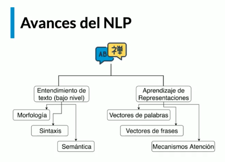
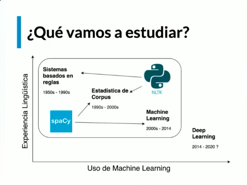
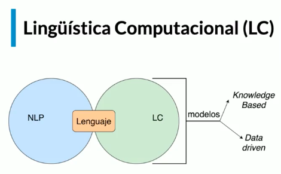
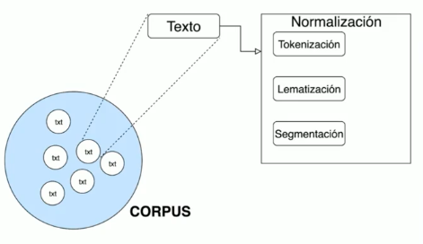

para buscar: cmd  +  F
para visualizar: cmd + altizq + v
para guardar: cmd + s

## Git Hub

Pasos para conectar tu proyecto a GitHub

1. Crea el repositorio en GitHub
Ve a github.com

Inicia sesión.

Haz clic en "New" o "Nuevo repositorio"

Asigna un nombre, por ejemplo: Procesamiento_de_Lenguaje_Natural_con_Python_y_NLTK

No marques la opción de crear README si ya tienes archivos locales.

Crea el repositorio y copia la URL SSH.

2. Desde la terminal: entra a la carpeta del proyecto local
```sh
cd ruta/a/tu/proyecto
```

3. Inicializa Git
```sh
git init
```

4. Agrega todos los archivos al área de preparación
```sh
git add .
```

5. Haz el primer commit
```sh
git commit -m "primero 28_6_25"
```

6. Conecta tu proyecto local con el repositorio de GitHub
Asegúrate de copiar tu enlace SSH correcto. Por ejemplo:

```sh
git remote add origin git@github.com:joanflorez-alt/Procesamiento_de_Lenguaje_Natural_con_Python_y_NLTK.git
```

7. Envía tu proyecto a GitHub (rama main)
```sh
git push -u origin main
```

# Próximos pasos útiles

🔸 Para subir futuros cambios:
```sh
git add .
git commit -m "Mi nuevo cambio"
git push
```

🔸 Para ver el estado actual del repositorio:
```sh
git status
```
🔸 Para clonar el repositorio en otro equipo:
```sh
git clone git@github.com:joanflorez-alt/Procesamiento_de_Lenguaje_Natural_con_Python_y_NLTK.git
```


## Procesamiento de Lenguaje Natural con Python y NLTK


¿Qué es el procesamiento del lenguaje natural?
El procesamiento del lenguaje natural (NLP) es un campo que fusiona ciencias de la computación, lingüística e inteligencia artificial. Su objetivo es lograr que las máquinas interactúen de manera efectiva con los humanos usando el lenguaje que utilizamos para comunicarnos día a día. Dentro del NLP, el Entendimiento del Lenguaje Natural (NLU, por sus siglas en inglés) se dedica a tareas específicas que demuestran que una máquina no solo puede procesar nuestro idioma, sino también comprenderlo para responder de manera coherente.

¿Cuál es el papel del test de Turing en la inteligencia artificial?
Alan Turing, un matemático brillante de la Segunda Guerra Mundial, es conocido por haber contribuido al desarrollo de la inteligencia artificial. Su legado incluye el Test de Turing, que propone una idea sencilla y poderosa: si un humano no puede distinguir a una máquina de una persona durante una conversación, la máquina alcanza un nivel de inteligencia comparable al humano. Este test representa un hito en la identificación del lenguaje como una medida de la inteligencia de una máquina.

Un ejemplo popular en la cultura es el test de Beuyk Kampff de la película "Blade Runner", donde se verifica si un individuo es humano o un replicante. Esta referencia cultural refuerza la importancia del procesamiento del lenguaje natural en el avance hacia la identificación de la inteligencia artificial.

¿Cuáles son las aplicaciones actuales del NLP?
El procesamiento del lenguaje natural se utiliza en diversas aplicaciones cotidianas:

Motores de búsqueda: Google, por ejemplo, usa algoritmos de NLP para interpretar consultas y brindar respuestas precisas.

Traducción automática: Herramientas como Google Translate dependen del NLP para convertir texto entre diferentes idiomas.

Chatbots: Los asistentes virtuales conversacionales son uno de los usos más reconocidos del NLP.

Análisis de discurso y reconocimiento del habla: Estos algoritmos identifican y transforman el lenguaje hablado en texto y viceversa.

¿Por qué es difícil el procesamiento del lenguaje natural?
El principal reto del NLP radica en la complejidad y ambigüedad del lenguaje humano. Un ejemplo claro es interpretaciones posibles para un anuncio de trabajo que busque "gente para trabajar entre dieciocho y treinta años". Una persona entiende que se refiere a la edad del candidato, pero un algoritmo, sin contexto, podría interpretar esto de manera distinta. El lenguaje humano es intrínsecamente difuso y requiere una comprensión contextual que a menudo no está explícita. Por ello, el avance en este campo es desafiante, pero también crucial para mejorar la interacción entre máquinas y humanos.


# EVOLUCIÓN DEL NLP


¿Cómo ha evolucionado el procesamiento del lenguaje natural?
El procesamiento del lenguaje natural (PLN) ha recorrido un largo camino desde sus inicios. Desde las primeras propuestas de Turing en los años cincuenta, pasando por el auge de los sistemas basados en reglas, hasta las innovaciones actuales con el deep learning. Este fascinante viaje revela cómo la tecnología y la lingüística se han combinado para acercarnos a máquinas que no solo entienden sino que también interactúan con nosotros.

¿Cuál fue el papel de los sistemas basados en reglas?
Al principio, los sistemas de PLN eran principalmente basados en reglas. Estas máquinas no aprendían de forma autónoma; en cambio, se programaban con reglas lingüísticas predefinidas. Esto les permitía generar conversaciones y reconocer si una frase estaba escrita o pronunciada correctamente, pero su capacidad era limitada. Fue un enfoque predominante hasta los años noventa, cuando la estadística empezó a jugar un papel más importante.

¿Cómo la estadística transformó el PLN?
A partir de los años noventa, las técnicas estadísticas comenzaron a dominar el PLN. Esto implicó entrenar algoritmos usando grandes corpus de texto, permitiendo a las máquinas aprender distribuciones probables de palabras. Esta transición marcó un cambio significativo: de basarse en reglas fijas a modelos que podían comprender y generar frases con sentido gramatical mediante el aprendizaje de patrones.

¿El rol de machine learning y deep learning en PLN?
A partir del año 2000, el machine learning tomó relevancia, ofreciendo algoritmos más sofisticados que se perfeccionaron hasta 2014. El verdadero punto de inflexión fue la democratización de las GPUs, permitiendo que el deep learning fuera accesible y revolucionara el PLN. Hoy en día, el deep learning es considerado el estado del arte, posibilitando algoritmos altamente precisos y eficientes para la comprensión y generación del lenguaje.

¿Por qué importa el entendimiento de texto a bajo nivel?
El análisis preciso de texto a bajo nivel es crucial en PLN. Existen algoritmos diseñados específicamente para tareas como clasificación de texto, análisis de sentimientos y comprensión contextual. Aunque son extremadamente eficaces en sus tareas, suelen estar limitados a un solo tipo de tarea.

¿Qué son los modelos multitarea y cuáles son sus ventajas?
Los avances en aprendizaje de representaciones han dado lugar a modelos multitarea, que utilizan redes neuronales para realizar múltiples funciones simultáneamente. Basados en conceptos matemáticos de representación, estos modelos asignan vectores a palabras y frases para identificar similitudes semánticas, permitiendo un procesamiento más versátil y eficaz.

¿Cuáles son las innovaciones recientes en arquitecturas neuronales?
Desde 2018, las arquitecturas como las redes Transformer y Reformer han revolucionado el PLN gracias a los mecanismos de atención. Estos permiten un análisis más inteligente de las secuencias de texto, procesando solo las palabras relevantes dentro de una frase sin analizarla por completo. Aunque estos avances son notables, aún existe el desafío de desarrollar algoritmos con comprensión de sentido común similar a la humana.

¿Cómo puedes iniciarte en el procesamiento del lenguaje natural?
Hoy en día, el aprendizaje de PLN comienza con el uso de dos librerías fundamentales: NLTK y spaCy. Estas herramientas ofrecen la base necesaria para explorar desde tareas simples hasta aplicaciones industriales más complejas.

¿Cómo se estructura el camino de aprendizaje en este curso?
El curso se divide en bloques esenciales:

Fundamentos de PLN con NLTK: Para entender y usar la estadística de corpus en tareas de PLN.

Aplicaciones: Usando NLTK para crear modelos que desempeñen diversas tareas de PLN.

NLP Industrial: Cómo escalar modelos a aplicaciones reales usando spaCy.

Bloque avanzado: Combinando NLTK y spaCy para abordar conceptos más complejos en PLN.

Con este camino estructurado, estarás preparado para sumergirte en el mundo del PLN y desarrollar aplicaciones prácticas que aprovechen la capacidad creciente de las máquinas para entender el lenguaje humano. No dudes en dejar tus comentarios sobre qué te entusiasma más de este curso y los proyectos que planeas crear.




# Librerias


## CONCEPTOS BÁSICOS NLP

¿Cuáles son los fundamentos del procesamiento del lenguaje natural?
El procesamiento del lenguaje natural (PLN) es un campo fascinante que combina la lingüística y la inteligencia artificial para permitir que las máquinas entiendan, interpreten y respondan al lenguaje humano de manera efectiva. En esta introducción, abordaremos los conceptos básicos y la diferencia entre el PLN y la lingüística computacional, así como algunos procesos clave involucrados en la normalización de texto.

¿Cuál es la diferencia entre procesamiento del lenguaje natural y lingüística computacional?
Aunque la meta de ambas áreas es comprender el lenguaje, sus enfoques difieren:

Procesamiento del lenguaje natural (PLN): Se centra en aplicaciones prácticas y está orientado hacia la ingeniería. Busca desarrollar sistemas que puedan comprender y generar lenguaje humano.
Lingüística computacional: Su enfoque es más científico, intentando resolver interrogantes del lenguaje mediante el estudio de cómo los humanos procesan y computan el lenguaje de manera innata.
¿Cómo se crean modelos en lingüística computacional?
La lingüística computacional crea modelos a partir de dos enfoques principales:

Basado en conocimiento: Se centra en reglas y principios lingüísticos.
Basado en datos: Utiliza aprendizaje automático (machine learning) alimentado por grandes volúmenes de datos, recurriendo al análisis estadístico.
¿Qué es la normalización de texto?
La normalización de texto es un proceso estándar en el procesamiento de lenguaje que incluye varias etapas de limpieza y transformación de texto para preparar datos textuales para el análisis.

¿En qué consiste la tokenización?
La tokenización divide un texto en unidades mínimas, comúnmente conocidas como palabras o tokens. Por ejemplo, la frase "Mi hermano dejó de comer" se tokeniza en las siguientes palabras: "Mi", "hermano", "dejó", "de", "comer".

¿Qué es la lematización?
La lematización transforma las palabras a su forma raíz o lema. Esto es especialmente útil para los verbos. En el ejemplo anterior, "dejó" se lematiza a "dejar".

¿Cómo se segmenta el texto en frases?
La segmentación en frases intenta dividir el texto en oraciones utilizando la puntuación. Sin embargo, este proceso puede ser complicado, ya que las reglas gramaticales no siempre son consistentes.

¿Qué es un corpus y cómo se diferencia de un corpora?
En la investigación del lenguaje, es importante conocer:

Corpus: Una colección de textos utilizada para analizar datos lingüísticos. Proporciona el material necesario para construir modelos estadísticos.
Corpora: Plural de corpus, es decir, una colección de colecciones de texto.
Estos conceptos son fundamentales para entender cómo se estructuran y utilizan los datos en el PLN.

En esta etapa inicial del procesamiento del lenguaje, es esencial dominar estos fundamentos, ya que sientan la base para aplicar técnicas más avanzadas de PLN. ¡Te animamos a seguir explorando y sumergiéndote en el apasionante mundo del procesamiento del lenguaje natural!






## Procesamiento de Lenguaje Natural con Python en Google Colab

La libreria NLTK ya trate texto incorporado corpus corpora

https://colab.research.google.com/drive/1NbB9Gw73N6t1gS_CDp1vhcJMNsDm1yZ8?usp=sharing


usaremos una base de datos en especial: 

nltk.download("cess_esp")


Ver:

https://docs.python.org/es/3.13/library/re.html


# Hasta el momento ya tomamos un corpus para analizar

## Expresiones Regulares en Python: Patrones de Búsqueda Avanzados

¿Cómo usar expresiones regulares en NLTK para analizar un corpus?
En el fascinante mundo de la lingüística computacional, las expresiones regulares juegan un papel crucial para realizar búsquedas avanzadas en grandes cantidades de texto, como un corpus. Si estás interesado en descubrir cómo construir patrones de búsqueda efectivos, estás en el lugar adecuado. En esta guía, desentrañamos el uso de las expresiones regulares con la librería NLTK (Natural Language Toolkit) y Python, desde lo básico hasta los patrones más sofisticados.

¿Qué es una expresión regular?
Las expresiones regulares son secuencias de caracteres que forman un patrón de búsqueda. Utilizadas en el procesamiento de texto, permiten navegar y filtrar información dentro de cadenas de texto para encontrar coincidencias específicas. Python cuenta con una poderosa librería llamada re que facilita su incorporación.

¿Cómo construir un arreglo filtrando palabras con expresiones regulares?
Comenzamos con la creación de un arreglo utilizando una expresión regular simple. A continuación, se muestra cómo definir patrones de búsqueda básicos y avanzados.

import re

# Ejemplo básico: Buscar palabras que contengan 'es'
AR = [w for w in flatten if re.search(r'es', w)]
En este fragmento de código, utilizamos la función re.search() de la librería de expresiones regulares de Python, especificando un patrón y evaluando cada palabra en la lista flatten. Si el patrón 'es' se encuentra en una palabra, esta se añade al nuevo arreglo AR.

¿Cómo redefinir patrones de búsqueda utilizando metacaracteres?
Los metacaracteres enriquecen las búsquedas con expresiones regulares al permitir una mayor especificidad, como buscar coincidencias al principio o al final de las palabras.

$: Marca el final de una cadena.

# Ejemplo: Solo palabras que terminan en 'es'
AR = [w for w in flatten if re.search(r'es$', w)]
^: Marca el inicio de una cadena.

# Ejemplo: Solo palabras que empiezan con 'es'
AR = [w for w in flatten if re.search(r'^es', w)]
¿Cómo utilizar rangos en las expresiones regulares?
Los rangos permiten definir un conjunto de caracteres que pueden ocupar una posición específica dentro de una cadena de texto:

# Ejemplo: Buscar palabras que comienzan con 'g', 'h' o 'i'
AR = [w for w in flatten if re.search(r'^[ghi]', w)]
En este ejemplo, creamos un arreglo donde filtramos palabras que empiezan con una letra ubicada entre 'g' y 'i'. Esto se logra definiendo un rango [ghi] como el primer carácter en las palabras seleccionadas en el arreglo.

¿Qué son las clausuras en las expresiones regulares?
Las clausuras especifican el número de repeticiones permitidas para un patrón dado:

*: Permite que un patrón se repita cero o más veces.

# Ejemplo: Patrones que pueden aparecer cero o más veces
AR = [w for w in flatten if re.search(r'^no*', w)]
+: Requiere que un patrón se repita al menos una vez.

# Ejemplo: Patrones que deben aparecer al menos una vez
AR = [w for w in flatten if re.search(r'^no+', w)]
Cómo seguir aprendiendo sobre expresiones regulares
¡Esto es solo el comienzo! Las expresiones regulares son una herramienta impresionante para aquellos apasionados por la computación y el análisis lingüístico. A medida que avances, podrás explorar cómo definir tokenizadores usando estas técnicas, ayudando a estructurar texto de manera más eficiente. No dudes en experimentar y seguir practicando para dominar su uso. Tu viaje en el ámbito del procesamiento de lenguaje natural será increíblemente enriquecedor. ¡Adelante!


# otro ejemplo

arr = [w for w in flatten if re.search("^(no)*", w)]
print(arr[:20])


## Tokenización de Texto con Expresiones Regulares en Python

¿Cómo usar expresiones regulares para definir algoritmos de tokenización en Python?
Las expresiones regulares son una herramienta poderosa que nos permite manipular texto de manera eficiente. En particular, cuando se trata de procesar lenguaje natural, podemos utilizarlas para definir algoritmos de tokenización en Python. En esta clase, exploraremos cómo aprovechar las expresiones regulares con la librería NLTK para tokenizar texto y limpiar nuestro corpus para análisis.

¿Qué es una cadena de texto RAW y cómo se utiliza?
Para que Python interprete una cadena de texto sin reconocer caracteres especiales, debemos utilizar el prefijo r delante de la cadena. Esto indica que Python debe tratar los caracteres especiales como texto plano, también conocido como texto "RAW".

Por ejemplo:

print(r"Esta es una cadena con una nueva línea \n que será mostrada tal cual.")
El uso de la r convierte a los caracteres especiales en parte del texto y no en comandos ejecutables dentro de la cadena, lo que es esencial cuando tratamos con texto que incluye caracteres de escape.

¿Cómo tokenizar texto con espacios vacíos?
Tokenizar texto es el proceso de dividirlo en unidades más pequeñas, conocidas como "tokens". El método más básico de tokenización es mediante la separación por espacios vacíos, y esto se puede lograr fácilmente utilizando la función split de la librería re.

import re

texto = "Cuando sea el rey del mundo, (imaginaba él en su cabeza) no tendré que preocuparme por estas bobadas."
tokens = re.split(r'\s+', texto)
Aquí, el uso de \s+ permite dividir el texto en base a uno o más espacios vacíos, creando tokens individuales para cada palabra.

¿Cómo mejorar la tokenización con expresiones regulares?
Para lograr un nivel de tokenización más sofisticado, podemos desarrollar expresiones regulares que filtren caracteres especiales no deseados.

Consideremos la siguiente expresión regular:

tokens = re.split(r'[ \t\n]+', texto)
Esta expresión busca espacios, tabulaciones y nuevas líneas, proporcionando una tokenización más limpia al eliminar estos caracteres del proceso.

¿Cómo crear un tokenizador sofisticado con NLTK?
A medida que los textos se vuelven más complejos, con caracteres y símbolos especiales, las expresiones regulares básicas no son suficientes. Aquí es donde NLTK ofrece una excelente solución con la función RegexpTokenizer.

Una aplicación avanzada de esta técnica se puede ver como sigue:

from nltk.tokenize import RegexpTokenizer

pattern = r'\b\w+\b'
tokenizer = RegexpTokenizer(pattern)
tokens = tokenizer.tokenize(texto)
El patrón \b\w+\b permite capturar palabras completas, evitando caracteres que no contribuyen al contenido semántico del texto.

¿Por qué usar Regex Token Eyes de NLTK?
Cuando enfrentamos textos altamente complejos, con abreviaciones, números decimales y otros elementos, Regex Token Eyes de NLTK se convierte en un recurso inestimable. Este tokenizador emplea expresiones regulares complejas para lograr una tokenización precisa.

from nltk.tokenize import RegexpTokenizer

pattern = r"\b\w+\b(?:[.\-]\w+)*"
tokenizer = RegexpTokenizer(pattern)
tokens = tokenizer.tokenize("En los EE.UU., esa postal vale quince cincuenta dólares...")
Así, podemos capturar correctamente acrónimos, precios y otros casos especiales como tokens únicos, mejorando significativamente la calidad del análisis.

Con herramientas como estas, estás en capacidad de construir un tokenizador tanto básico como avanzado para diversas aplicaciones en procesamiento de lenguaje natural. ¡Sigue explorando y sorprendiendo al mundo con tus habilidades en Python!


## ¿Cómo utilizar la estadística en el procesamiento del lenguaje natural?
El procesamiento del lenguaje natural (NLP, por sus siglas en inglés) es un campo fascinante que combina la informática, la inteligencia artificial y la lingüística computacional para entender e interpretar el lenguaje humano. Un elemento clave en este proceso es el uso de la estadística para analizar textos y extraer información valiosa. En este artículo, profundizaremos en cómo las herramientas estadísticas se aplican en NLP para enriquecer nuestra comprensión del lenguaje.

¿Qué herramientas y librerías son esenciales para el análisis estadístico en texto?
Para un análisis estadístico efectivo en NLP usando Python, se necesitan varias librerías y herramientas cruciales. Aquí te presento algunas de las más destacadas:

NLTK (Natural Language Toolkit): Es una de las librerías más utilizadas para trabajar con lenguaje natural en Python. Proporciona herramientas para tokenización, etiquetado, análisis de texto y más.

Matplotlib: Esta es una librería de visualización de datos en Python que es muy útil para presentar gráficos y distribuciones.

NumPy: Una librería fundamental cuando se trabaja con álgebra lineal y matemáticas avanzadas en Python. Es esencial para el manejo eficiente de matrices y vectores. Existen cursos dedicados a profundizar en su uso.

Además, es frecuente trabajar con datasets preexistentes, como el books dataset de NLTK, que contiene libros tokenizados en inglés, siendo uno de los más útiles para procesamiento de texto.

¿Cómo comenzar a tokenizar y calcular métricas del texto?
Cuando se trabaja con textos, un paso inicial crítico es la tokenización, es decir, dividir el texto en palabras o tokens individuales. Una vez tokenizado, se pueden calcular métricas útiles que nos proporcionan información sobre el texto, como la longitud del texto y la riqueza léxica.

Tokenización: Con NLTK, puedes fácilmente importar datasets y comenzar a tokenizar. Por ejemplo, usando from nltk import book y luego consultando los tokens específicos para un texto.
from nltk.book import *
tokens = text1[:10]  # Obtén los primeros 10 tokens
Longitud y riqueza léxica: La longitud del texto se refiere al número total de tokens, mientras que la riqueza léxica se define como el número de palabras únicas dividido por el total de palabras.
longitud_texto = len(text1)
vocabulario = set(text1)
riqueza_lexica = len(vocabulario) / longitud_texto
¿Cómo definir funciones útiles para el análisis de texto?
Definir funciones en Python facilita la reutilización del código y permite calcular métricas como la riqueza léxica y el porcentaje de uso de palabras. Veamos cómo definir algunas funciones útiles:

Función para calcular riqueza léxica:
def riqueza_lexica(texto):
    vocabulario = set(texto)
    return len(vocabulario) / len(texto)
Esta función nos ayuda a calcular qué tan diverso es el vocabulario del texto.

Función para calcular el porcentaje de una palabra:
def porcentaje_palabra(palabra, texto):
    return 100 * texto.count(palabra) / len(texto)
Utilizando esta función, podemos determinar qué tan común es una palabra en particular dentro de un texto, expresado como un porcentaje.

En conclusión, el uso de herramientas estadísticas en NLP es esencial para el análisis y comprensión profunda de textos. Estas técnicas nos permiten desentrañar patrones del lenguaje y realizar interpretaciones que de otra manera no serían posibles. Con práctica y curiosidad, podrás sacar el máximo provecho a estas herramientas y funciones para tus futuros proyectos en procesamiento del lenguaje natural.


Siguiente recomendado: 

Curso de introducción a Machine learning. 
Curso de expresiones regulares

